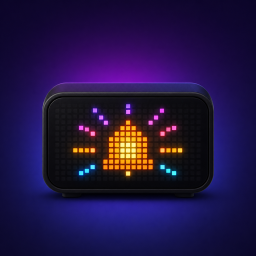

# homebridge-lametric-time-messenger

[](https://github.com/homebridge/homebridge/wiki/Verified-Plugins)



## English

Dynamic Homebridge platform plugin for sending local notifications to one or more LaMetric TIME V2 clocks.

> Compatibility notice: this plugin targets LaMetric TIME V2 / 2022+ devices. The first-generation LaMetric TIME is not supported by this plugin because its local API key/authentication flow can differ and has not been validated reliably.

### Documentation

Detailed documentation is available in the repository wiki:

- [Home](wiki/Home.md)
- [Configuration options](wiki/Configuration-Options.md)

The plugin uses the LaMetric Device API v2 local endpoint:

```text
POST http://<device-host>:8080/api/v2/device/notifications
```

HTTPS on port `4343` can be configured, but the plugin does not disable TLS verification globally. If your device uses a self-signed local certificate and Node rejects it, prefer HTTP on a trusted local network for now.

### Compatibility

- Homebridge: `^1.6.0 || ^2.0.0`
- Node.js: `^22.12.0 || ^24.0.0`
- LaMetric: LaMetric TIME V2 / 2022+ devices only
- Plugin type: dynamic platform
- Module format: ESM

Homebridge 2 compatibility is based on the official dynamic platform model and avoids deprecated callback characteristics by using `onGet` and `onSet`.

### Installation

#### Homebridge UI

After the package is published to npm, install it from the Homebridge UI:

1. Open Homebridge UI.
2. Go to **Plugins**.
3. Search for `homebridge-lametric-time-messenger`.
4. Click **Install**.
5. Restart Homebridge.

#### npm

```sh
npm install -g homebridge-lametric-time-messenger
```

#### Local development install

```sh
npm install
npm run build
npm link
```

### LaMetric local API key

Enable or retrieve the local Device API key from your LaMetric developer/device settings. The plugin authenticates with HTTP Basic auth:

- user: `dev`
- password: your local LaMetric API key

The key is configured as a Homebridge UI password field and is never logged by the plugin.

### Homebridge UI configuration

The plugin ships a `config.schema.json`, so Homebridge UI can render the configuration form without a custom UI.

Sections:

- General settings: debug logging, queue size, duplicate behavior, global delay, optional test switch.
- LaMetric TIME V2 devices: internal ID, display name, host, protocol, port, API key, timeout, retries, optional per-device connection test switch, optional silent hours.
- Messages: internal ID, name, target devices, HomeKit switch exposure, auto-reset, cooldown, priority, icon type, cycles, frames, optional sound.

The schema can mask the API key with `format: password`. Enable `connectionTestSwitch` on a device to expose a HomeKit switch named `Test <device name>`. Turning it on sends a critical local test notification to that device only and the switch automatically returns to off.

Detailed configuration documentation is available in the repository wiki.

### Scoped Homebridge plugin compatibility

Homebridge scoped plugins use the npm organization `@homebridge-plugins/`. A future scoped package for this plugin would therefore be named:

```text
@homebridge-plugins/homebridge-lametric-time-messenger
```

Only the Homebridge collaborators team can initially publish packages under that scope. The current public package remains:

```text
homebridge-lametric-time-messenger
```

The plugin keeps a stable HomeKit accessory UUID namespace that does not depend on whether the npm package is scoped or unscoped. This is intended to make a future scoped migration safe for existing HomeKit accessories, rooms, scenes, and automations when following the Homebridge scoped-plugin migration process.

### Example configuration

```json
{
  "platform": "LaMetricTime",
  "name": "LaMetric Time",
  "debug": false,
  "maxQueueSize": 50,
  "duplicateStrategy": "drop",
  "globalDelayMs": 250,
  "testSwitch": true,
  "devices": [
    {
      "id": "salon",
      "name": "LaMetric Salon",
      "host": "192.168.1.50",
      "protocol": "http",
      "port": 8080,
      "apiKey": "SECRET",
      "timeoutMs": 5000,
      "retryCount": 2,
      "retryBackoffMs": 500,
      "connectionTestSwitch": true,
      "silentHours": [
        {
          "enabled": true,
          "start": "22:00",
          "end": "07:00",
          "mode": "criticalOnly"
        },
        {
          "enabled": true,
          "start": "20:00",
          "end": "22:00",
          "mode": "mute"
        }
      ]
    }
  ],
  "messages": [
    {
      "id": "front-door-open",
      "name": "Door open",
      "deviceIds": ["salon"],
      "exposeSwitch": true,
      "autoResetMs": 1000,
      "cooldownMs": 5000,
      "priority": "info",
      "iconType": "none",
      "cycles": 1,
      "frames": [
        {
          "order": 0,
          "icon": "a1234",
          "text": "Door {{name}} opened"
        }
      ],
      "sound": {
        "enabled": true,
        "category": "notifications",
        "id": "positive1",
        "repeat": 1
      }
    }
  ]
}
```

### Home app automation example

1. A HomeKit contact sensor detects that a front door opened.
2. An Apple Home automation turns on the virtual switch `Door open`.
3. Homebridge builds and queues the configured LaMetric notification.
4. The plugin sends the notification locally to the selected LaMetric.
5. The switch automatically returns to off after `autoResetMs`.

The plugin does not claim to observe every accessory managed by other Homebridge plugins directly. Use Apple Home automations or another supported trigger to turn on the virtual switch.

### Notifications

Each message contains one or more frames. Frames are sorted by `order` during configuration validation.

Supported template variables:

- `{{date}}`
- `{{time}}`
- `{{name}}`
- `{{value}}`

Missing values render as an empty string. Templates do not execute JavaScript and do not use `eval` or `Function`.

### Priorities, icons, and sounds

The LaMetric Device API documents notification priorities:

- `info`: normal queue priority.
- `warning`: higher priority than internal notifications.
- `critical`: interrupts other notifications and wakes the device from sleep/screensaver.

If the LaMetric returns `Only notifications with priority 'critical' are allowed in current mode`, edit the message in Homebridge UI and set its priority to `Critical`. This usually means the device is currently in a restrictive mode such as sleep, screen saver, or do-not-disturb. The global Homebridge test switch uses `critical` by default so it can still validate the connection in that state.

`iconType` supports `none`, `info`, and `alert`.

Frame icons can use LaMetric icon IDs such as:

- `i1234` for a static icon.
- `a1234` for an animated icon.

Sound categories supported by the API are `notifications` and `alarms`. The plugin omits the `sound` object entirely when sound is disabled.

### Silent hours

Use `devices[].silentHours` to define quiet ranges for each LaMetric using the Homebridge server local time in `HH:mm` format. Ranges can cross midnight, for example `22:00` to `07:00`.

For compatibility with `0.1.5`, a top-level `silentHours` block is still accepted as a fallback for devices that do not define their own ranges. Prefer per-device configuration for new setups.

Supported modes:

- `criticalOnly`: only messages with priority `critical` are queued for that LaMetric during the range.
- `mute`: messages are still queued for that LaMetric, but the outgoing payload omits `sound`.

If ranges overlap on the same LaMetric, `criticalOnly` takes precedence over `mute`. Messages targeting multiple devices are evaluated separately for each LaMetric.

### Queue and anti-spam

The plugin keeps in-memory queues per LaMetric device:

- processing is sequential per device;
- different devices can process independently;
- queue size is limited;
- cooldown is applied per message after a successful send only;
- duplicates can be enqueued, dropped, or replaced;
- failures are logged and the queue continues.

Queues are not persisted. API keys and notification payloads are not written to log files by the plugin.

### TODO

- Add automatic discovery for LaMetric devices on the local network.
- Add richer template variables such as `{{device}}`, `{{messageId}}`, `{{weekday}}`, and custom date/time formats.
- Expose an optional local API for sending ad hoc notifications from scripts, local webhooks, or shortcuts.
- Add optional HomeKit status accessories for connection state, last error, or active queue state.
- Persist critical queued notifications across Homebridge restarts.
- Add reusable notification profiles for priority, sound, cycles, icon type, and cooldown defaults.
- Add internal counters for sent, failed, duplicate-dropped, cooldown-dropped, and last-success events.
- Expand the documentation with ready-to-use automation examples such as doorbell, laundry done, bins, alarm, presence, and weather alerts.

### Troubleshooting

`401 Authentication refused`: verify the local API key and ensure there are no extra spaces.

`404 endpoint not found`: verify the host, port, protocol, and that the device supports Device API v2 notifications.

Timeout or unreachable device: verify that Homebridge can reach the LaMetric on the local network. HTTP usually uses port `8080`; HTTPS usually uses port `4343`.

`429 rate limit`: increase `globalDelayMs`, reduce automations that trigger the same message, or use cooldowns.

### Security

- No cloud service is used.
- No telemetry is included.
- The plugin accepts host, protocol, and port, not arbitrary URLs.
- Only `http` and `https` protocols are accepted.
- Header injection characters are rejected.
- Text and payload inputs are bounded.
- API keys and Authorization headers are never logged.
- TLS validation is not disabled globally.

### Development

```sh
npm install
npm run lint
npm run build
npm test
npm run verify:pack
```

Tests mock the LaMetric API and do not require a real device.

### Publishing

Before publishing:

1. Confirm repository, bugs, homepage, author, and license metadata.
2. Run `npm run lint`, `npm run build`, `npm test`, and `npm run verify:pack`.
3. Create and push a release tag matching `package.json`, for example `v0.1.4`.
4. GitHub Actions publishes the package to npm through Trusted Publishing.

For a scoped package, use `npm publish --access=public` the first time.

Configure npm Trusted Publishing for this package with:

- Publisher: GitHub Actions
- Organization or user: `deadbone`
- Repository: `homebridge-lametric-time`
- Workflow filename: `publish.yml`
- Allowed actions: `npm publish`
- Environment name: leave empty unless a GitHub deployment environment is added later.

The publish workflow also handles automatic releases for merged pull requests. When a PR is merged into `main`, `.github/workflows/publish.yml` runs the same validation, bumps the patch version, creates the matching `vX.Y.Z` tag, pushes the release commit and tag back to `main`, publishes the package to npm, then creates a GitHub Release marked as Latest.

For pull requests opened from this repository, the same workflow publishes a unique npm prerelease with the `beta` dist-tag after validation. Install the latest PR beta with:

```sh
npm install -g homebridge-lametric-time-messenger@beta
```

The beta version includes the PR number and GitHub Actions run details, and does not replace the stable `latest` release.

## Français

Plugin de plateforme dynamique Homebridge permettant d’envoyer des notifications locales vers une ou plusieurs horloges LaMetric TIME V2.

> Version stable : ce plugin est actuellement en `0.1.3`.

> Note de compatibilité : ce plugin cible uniquement les appareils LaMetric TIME V2 / 2022+. La première génération de LaMetric TIME n’est pas prise en charge, car son flux d’authentification / clé API locale peut différer et n’a pas pu être validé de façon fiable.

### Documentation

La documentation detaillee est disponible dans le wiki du depot :

- [Accueil](wiki/Home.md)
- [Options de configuration](wiki/Configuration-Options.md)

Le plugin utilise l’endpoint local LaMetric Device API v2 :

```text
POST http://<adresse-appareil>:8080/api/v2/device/notifications
```

HTTPS sur le port `4343` peut être configuré, mais le plugin ne désactive pas globalement la vérification TLS. Si l’appareil utilise un certificat local autosigné et que Node.js le refuse, privilégiez HTTP sur un réseau local de confiance pour le moment.

### Compatibilité

- Homebridge : `^1.6.0 || ^2.0.0`
- Node.js : `^22.12.0 || ^24.0.0`
- LaMetric : appareils LaMetric TIME V2 / 2022+ uniquement
- Type de plugin : plateforme dynamique
- Format de module : ESM

La compatibilité Homebridge 2 repose sur le modèle officiel de plateforme dynamique et évite les caractéristiques à callbacks dépréciées en utilisant `onGet` et `onSet`.

### Installation

#### Homebridge UI

Une fois le paquet publié sur npm, installez-le depuis Homebridge UI :

1. Ouvrez Homebridge UI.
2. Allez dans **Plugins**.
3. Recherchez `homebridge-lametric-time-messenger`.
4. Cliquez sur **Install**.
5. Redémarrez Homebridge.

#### npm

```sh
npm install -g homebridge-lametric-time-messenger
```

#### Installation locale de développement

```sh
npm install
npm run build
npm link
```

### Clé API locale LaMetric

Activez ou récupérez la clé locale Device API depuis les réglages développeur/appareil LaMetric. Le plugin s’authentifie en HTTP Basic auth :

- utilisateur : `dev`
- mot de passe : votre clé API locale LaMetric

La clé est configurée dans Homebridge UI comme champ mot de passe et n’est jamais écrite dans les logs du plugin.

### Configuration Homebridge UI

Le plugin fournit un fichier `config.schema.json`, ce qui permet à Homebridge UI d’afficher le formulaire de configuration sans interface personnalisée.

Sections :

- Réglages généraux : logs de debug, taille de file, comportement des doublons, délai global, switch de test optionnel.
- Appareils LaMetric TIME V2 : identifiant interne, nom affiché, hôte, protocole, port, clé API, délai d’attente, tentatives, switch de test optionnel, horaires silencieux optionnels.
- Messages : identifiant interne, nom, appareils cibles, exposition du switch HomeKit, réinitialisation automatique, cooldown, priorité, type d’icône, cycles, frames, son optionnel.

Le schéma masque la clé API avec `format: password`. Les boutons de test par appareil ne sont pas inclus dans cette version, car le formulaire standard Homebridge UI ne fournit pas de flux serveur fiable pour ce type de bouton.

La documentation détaillée des options de configuration est disponible dans le wiki du dépôt.

### Compatibilité avec les plugins scopés Homebridge

Les plugins scopés Homebridge utilisent l’organisation npm `@homebridge-plugins/`. Un futur paquet scopé pour ce plugin s’appellerait donc :

```text
@homebridge-plugins/homebridge-lametric-time-messenger
```

Seule l’équipe de collaborateurs Homebridge peut publier initialement des paquets sous ce scope. Le paquet public actuel reste :

```text
homebridge-lametric-time-messenger
```

Le plugin conserve un namespace UUID HomeKit stable qui ne dépend pas du fait que le paquet npm soit scopé ou non. L’objectif est de permettre une future migration scoped sans recréer les accessoires HomeKit, pièces, scènes et automatisations, à condition de suivre la procédure de migration Homebridge.

### Exemple de configuration

```json
{
  "platform": "LaMetricTime",
  "name": "LaMetric Time",
  "debug": false,
  "maxQueueSize": 50,
  "duplicateStrategy": "drop",
  "globalDelayMs": 250,
  "testSwitch": true,
  "devices": [
    {
      "id": "salon",
      "name": "LaMetric Salon",
      "host": "192.168.1.50",
      "protocol": "http",
      "port": 8080,
      "apiKey": "SECRET",
      "timeoutMs": 5000,
      "retryCount": 2,
      "retryBackoffMs": 500,
      "silentHours": [
        {
          "enabled": true,
          "start": "22:00",
          "end": "07:00",
          "mode": "criticalOnly"
        },
        {
          "enabled": true,
          "start": "20:00",
          "end": "22:00",
          "mode": "mute"
        }
      ]
    }
  ],
  "messages": [
    {
      "id": "front-door-open",
      "name": "Porte ouverte",
      "deviceIds": ["salon"],
      "exposeSwitch": true,
      "autoResetMs": 1000,
      "cooldownMs": 5000,
      "priority": "info",
      "iconType": "none",
      "cycles": 1,
      "frames": [
        {
          "order": 0,
          "icon": "a1234",
          "text": "Porte {{name}} ouverte"
        }
      ],
      "sound": {
        "enabled": true,
        "category": "notifications",
        "id": "positive1",
        "repeat": 1
      }
    }
  ]
}
```

### Exemple d’automatisation Apple Maison

1. Un capteur de contact HomeKit détecte l’ouverture d’une porte.
2. Une automatisation Apple Maison active le switch virtuel `Porte ouverte`.
3. Homebridge construit et met en file la notification LaMetric configurée.
4. Le plugin envoie la notification localement à la LaMetric sélectionnée.
5. Le switch revient automatiquement à Off après `autoResetMs`.

Le plugin ne prétend pas observer directement tous les accessoires gérés par d’autres plugins Homebridge. Utilisez des automatisations Apple Maison ou un autre déclencheur compatible pour activer le switch virtuel.

### Notifications

Chaque message contient une ou plusieurs frames. Les frames sont triées par `order` pendant la validation de configuration.

Variables de modèle prises en charge :

- `{{date}}`
- `{{time}}`
- `{{name}}`
- `{{value}}`

Les valeurs absentes sont remplacées par une chaîne vide. Les modèles n’exécutent pas de JavaScript et n’utilisent ni `eval` ni `Function`.

### Priorités, icônes et sons

La Device API LaMetric documente les priorités suivantes :

- `info` : priorité normale.
- `warning` : priorité plus élevée que les notifications internes.
- `critical` : interrompt les autres notifications et réveille l’appareil depuis le mode veille / écran de veille.

Si la LaMetric renvoie `Only notifications with priority 'critical' are allowed in current mode`, modifiez le message dans Homebridge UI et mettez sa priorité sur `Critical`. Cela signifie généralement que l’appareil est dans un mode restrictif comme veille, écran de veille ou ne pas déranger. Le switch de test global utilise `critical` par défaut afin de pouvoir valider la connexion dans cet état.

`iconType` prend en charge `none`, `info` et `alert`.

Les icônes de frame peuvent utiliser les identifiants LaMetric :

- `i1234` pour une icône statique.
- `a1234` pour une icône animée.

Les catégories de son prises en charge par l’API sont `notifications` et `alarms`. Le plugin omet entièrement l’objet `sound` lorsque le son est désactivé.

### Horaires silencieux

Utilisez `devices[].silentHours` pour définir des plages calmes par LaMetric avec l’heure locale du serveur Homebridge au format `HH:mm`. Les plages peuvent traverser minuit, par exemple `22:00` à `07:00`.

Pour rester compatible avec `0.1.5`, un bloc `silentHours` au niveau racine est encore accepté comme fallback pour les appareils qui ne définissent pas leurs propres plages. Privilégiez la configuration par appareil pour les nouvelles installations.

Modes disponibles :

- `criticalOnly` : seuls les messages avec la priorité `critical` sont mis en file pour cette LaMetric pendant la plage.
- `mute` : les messages sont encore mis en file pour cette LaMetric, mais le payload envoyé omet `sound`.

Si plusieurs plages se chevauchent sur la même LaMetric, `criticalOnly` est prioritaire sur `mute`. Les messages ciblant plusieurs appareils sont évalués séparément pour chaque LaMetric.

### File d’attente et anti-spam

Le plugin maintient des files en mémoire par appareil LaMetric :

- le traitement est séquentiel par appareil ;
- plusieurs appareils peuvent traiter leurs files indépendamment ;
- la taille de file est limitée ;
- le cooldown est appliqué par message uniquement après un envoi réussi ;
- les doublons peuvent être ajoutés, ignorés ou remplacés ;
- les erreurs sont journalisées et la file continue.

Les files ne sont pas persistées. Les clés API et les payloads de notification ne sont pas écrits dans les logs par le plugin.

### Dépannage

`401 Authentication refused` : vérifiez la clé API locale et assurez-vous qu’il n’y a pas d’espace copié en trop.

`404 endpoint not found` : vérifiez l’hôte, le port, le protocole et le support de l’endpoint Device API v2 par l’appareil.

Timeout ou appareil inaccessible : vérifiez que Homebridge peut joindre la LaMetric sur le réseau local. HTTP utilise généralement le port `8080`, HTTPS le port `4343`.

`429 rate limit` : augmentez `globalDelayMs`, réduisez les automatisations qui déclenchent le même message, ou utilisez les cooldowns.

### Sécurité

- Aucun service cloud n’est utilisé.
- Aucune télémétrie n’est incluse.
- Le plugin accepte un hôte, un protocole et un port, pas des URL arbitraires.
- Seuls les protocoles `http` et `https` sont acceptés.
- Les caractères d’injection d’en-têtes sont rejetés.
- Les textes et payloads sont bornés.
- Les clés API et en-têtes Authorization ne sont jamais journalisés.
- La validation TLS n’est pas désactivée globalement.

### Développement

```sh
npm install
npm run lint
npm run build
npm test
npm run verify:pack
```

Les tests simulent l’API LaMetric et ne nécessitent pas d’appareil réel.

### Publication

Avant publication :

1. Vérifier les métadonnées repository, bugs, homepage, author et license.
2. Exécuter `npm run lint`, `npm run build`, `npm test` et `npm run verify:pack`.
3. Créer et pousser un tag de release correspondant à `package.json`, par exemple `v0.1.4`.
4. GitHub Actions publie le package sur npm avec Trusted Publishing.

Pour un paquet scopé, utiliser `npm publish --access=public` lors de la première publication.

Configurer npm Trusted Publishing pour ce package avec :

- Publisher : GitHub Actions
- Organization or user : `deadbone`
- Repository : `homebridge-lametric-time`
- Workflow filename : `publish.yml`
- Allowed actions : `npm publish`
- Environment name : laisser vide sauf si un environnement de déploiement GitHub est ajouté plus tard.

Le workflow de publication gère aussi les releases automatiques pour les pull requests mergées. Lorsqu’une PR est mergée dans `main`, `.github/workflows/publish.yml` exécute les mêmes validations, incrémente la version patch, crée le tag `vX.Y.Z` correspondant, pousse le commit de release et le tag sur `main`, publie le paquet sur npm, puis crée une GitHub Release marquée comme Latest.

Pour les pull requests ouvertes depuis ce dépôt, le même workflow publie aussi une préversion npm unique avec le dist-tag `beta` après validation. Installer la dernière beta de PR :

```sh
npm install -g homebridge-lametric-time-messenger@beta
```

La version beta contient le numéro de PR et les informations du run GitHub Actions, et ne remplace pas la release stable `latest`.
